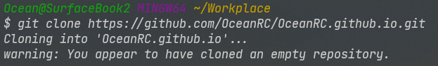

+++
author = "Ocean"
title = "使用 Github Pages 部署 Stack 主题的 Hugo 网站"
date = "2023-10-25"
description = "一个简单的 Hugo 站点部署教程，使用 Stack 主题，使用 Github Pages 部署"
categories = [
    "技术"，"站点"
]
tags = [
    "Win", "Hugo", "Github"
]
image = "clark-tibbs-oqStl2L5oxI-unsplash.jpg.jpg"
slug = "deploy-hugo-website-with-stack-theme-using-github-pages"
+++


# 使用 Github Pages 部署 Stack 主题的 Hugo 网站

## 安装 Hugo与Git

### 安装 Hugo

如果使用 Windows 10 以上系统，可以直接在 Powershell 中执行 `winget install Hugo.Hugo.Extended` 来进行一键安装。

或者参考 [Installation | Hugo (gohugo.io)](https://gohugo.io/installation/) 的内容进行安装。

### 安装 Git

也可以使用 `Winget install Git.Git` 的方式一键安装，此外也有下载安装包的方法，不在此过多赘述。

如果你是第一次使用 Git，请参考 [设置 Git - GitHub 文档](https://docs.github.com/zh/get-started/quickstart/set-up-git) 进行设置。

你可能还需要安装 GitHub CLI 来进行登录 GitHub 等一系列操作，在这里使用 `winget install GitHub.cli` 进行安装，具体配置请参考：[GitHub CLI 快速入门 - GitHub 文档](https://docs.github.com/zh/github-cli/github-cli/quickstart)。

## 新建 Github repository 与拉取到本地

在你的 Github 账户中，新建一个名为 `<你的用户名>.github.io` 的库，这是我们将来部署 Github Pages 的地方，在此部署的网站域名也为 `<你的用户名>.github.io`，后期可以使用你自己的域名。

除了填写用户名，其他默认留空即可。（我这里已经建好了，所以有个红字提示冲突）


建好后，应该跳转到了类似页面，点击复制下图框中的链接，我们接下来要用到。


可以使用 Git Bash 或者 PowerShell 来进行以下的操作：

首先在你 cd 进本地保存网站的地方，然后讲这个库 clone 下来。

```shell
git clone https://github.com/<你的用户名>/<你的用户名>.github.io.git
```



## 创建 Hugo 新站与使用 stack 主题

使用 Hugo 脚手架建立一个新站，名称为 `<你的用户名>.github.io`，因为该文件夹里已经有了 Git 的配置文件，所以不为空，需要强制执行。

```shell
hugo new site --force <你的用户名>.github.io
```


这样一个站点就已经初始化完成了，接下来让我们安装 Stack 主题。

先 `cd` <你的用户名>.github.io，进入到你的 Hugo 站点根目录，然后执行下面这行命令。

```shell
git submodule add https://github.com/CaiJimmy/hugo-theme-stack/ themes/hugo-theme-stack
```

这将把 Stack 主题添加为 Git 子模块，这可以将主题与网站其他内容各自进行版本管理。


此时文件结构如下：

```shell
.
├── archetypes
│   └── default.md
├── assets
├── content
├── data
├── hugo.toml #这是现在版本默认的 hugo 配置文件
├── i18n
├── layouts
├── static
└── themes
    └── hugo-theme-stack
```

## 进行本地预览

在网站根目录下，删除 `hugo.toml`，将 `/themes/hugo-theme-stack/exampleSite/config.yaml` 复制到根目录。

```shell
# 移除位于网站根目录下的 hugo.toml 文件
rm hugo.toml

# 复制 /themes/hugo-theme-stack/exampleSite/config.yaml 到网站根目录
cp themes/hugo-theme-stack/exampleSite/config.yaml .

# 本地的预览文件会在 public 中，此方法可以避免多余文件被上传
echo '/public/' > .gitignore
```

Hugo 现在的版本不再以 `config.yaml` 为默认配置文件，但仍会寻找它，详情参考：[Configure Hugo | Hugo (gohugo.io)](https://gohugo.io/getting-started/configuration/)。

在根目录下执行：

```shell
hugo server -D
```

## 将本地内容提交到 GitHub

执行以下内容：

```shell
git add .
git commit -m "first commit"
git push -u origin main
```

也可以直接使用 Github Desktop 来进行提交。

## 新建 Github Action 来构建 Github Pages

Github 提供了 Hugo 建站的模板，而且你几乎不需要修改此模板，便可以直接使用。


在 Action 页面搜索 Hugo，点击 Configure 即可。

可以将其配置中的 HUGO_VERSION 改为你当前使用版本，避免可能存在的冲突，不该也是可以正常运行的。


直接 commit 即可。

等待部署完成后打开 <你的用户名>.github.io 即可。


