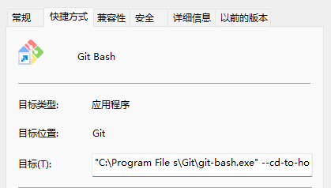
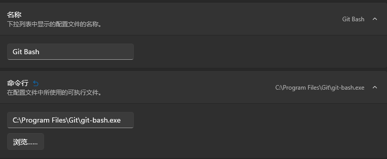
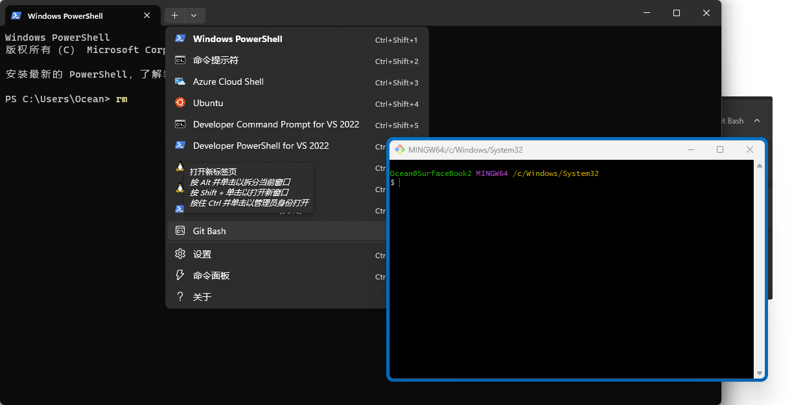
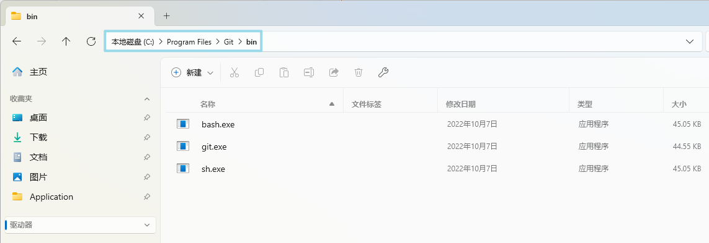
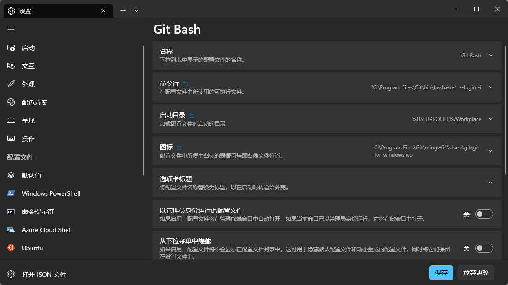
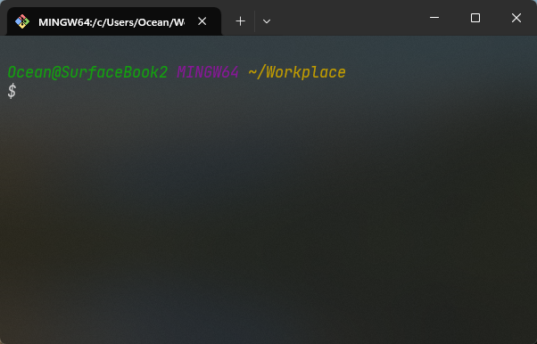

+++
author = "Ocean"
title = "如何在 Windows Terminal 中使用 Git Bash"
date = "2023-10-24"
description = "解决了 Git Bash 直接弹出与中文字符乱码的问题"
categories = [
    "技术"
]
tags = [
    "Win",
]
image = "terminal.jpg"
+++

# 如何在 Windows Terminal 中使用 Git Bash

## Why Git Bash？

> 如果你是通过搜索引擎查找到这篇文章的，想必已经知道 Git Bash 的优点，可以直接跳过这部分内容。

Windows 自带的终端工具一般是 PowerShell 与命令行，命令行不必多说，无论是语法还是功能都已经基本过时。至于 PowerShell，则是一款功能强大的现代化终端工具，有着强大的补全与检索功能，并努力实现了与其他 Linux 端常用终端的命令兼容。

但在实际操作过程中，这种命令并不是完全一一对应的，比如，在 PowerShell 中执行 `ls` 命令，实际上是执行了 `Get-Children` 命令，与在 Linux 下的操作有所不同，比如 PowerShell 不可以执行 `ls -a`，因为 `Get-Children` 命令本来就会默认显示隐藏文件夹。

被人津津乐道的一键删库跑路指令 `rm -rf /*` 在PowerShell 中也无法执行，因为这个命令在 PowerShell 中实际执行的是 `Remove-Item`，其没有 `-rf` 参数，同时以 PowerShell 的语法进行这种操作也会有二次确认。

Git Bash 则原汁原味的保留了 LInux 下的常用命令的所有参数操作，使用起来更为方便，而且基本安装 Git 必定会捎带安装 Git Bash。

## 一点意外？

如果你是通过搜索引擎进来的很可能也遇到了我之前遇到的问题。如果你是在开始菜单直接搜索 Git Bash 查找其指向的位置，并将其直接输入进 Windows Terminal 的配置中的话，当你打开这个页面的时候会直接弹出 Git Bash 的窗口，而不是在 Windows 终端打开它。







经过直接在 Git 的安装目录下查找，在这个文件夹（C:\Program Files\Git\bin）下可以找到我们需要使用的 bash.exe 文件。



### So Why Bash.exe？

为什么是 bash.exe 而不是之前 Git-bash.exe，其实这涉及到一个 Shell 与 Terminal 的关系，简单来说 Shell 是其内核，负责处理输入与输出，而 Terminal 只是提供一个展示方式，将 Shell 的输入、输出展示出来，这样分开的好处是可以更换 Terminal 来更换显示方式，对于其 Shell 内核不做改动。

我们需要的是一个 Shell，而不是展示其的程序，所以我们真正用到的应该是 Bash.exe 这个可执行文件。

这只是一个粗略的解释，而且现在我们提到 Shell、Terminal 和 Console 几乎是一个意思。

更多内容。请参考：[终端、控制台和 Shell 的区别 — Linux latest 文档 (gnu-linux.readthedocs.io)](https://gnu-linux.readthedocs.io/zh/latest/Chapter03/40_console.html)

## 配置 Windows Terminal

说了这么多废话，我们终于开始进行配置，实际上，配置过程非常简单，只需要依次填入以下内容即可：

1. 名称：Git Bash
2. 命令行："C:\Program Files\Git\bin\bash.exe"  --login -i （为什么有这个参数我们放在之后再讲）
3. 启动目录：这个实际上因人而异，我个人用的是 `%USERPROFILE%/Workplace`，如果你想要默认为当前用户路径的话，不修改就可以
4. 图标：C:\Program Files\Git\mingw64\share\git\git-for-windows.ico



或者你也可以直接使用 JSON 进行配置，配置如下（我设置了字体与亚克力模糊）：

```json
{
    "commandline": "\"C:\\Program Files\\Git\\bin\\bash.exe\" --login -i",
    "font": 
    {
        "face": "JetBrainsMono NF"
    },
    "guid": "{abc00000-0000-0000-0000-000000000000}", //这个是微软常用的唯一识别码，改不改都行，没什么用
    //也可以使用 http://tool.pfan.cn/guidgen 生成
    "hidden": false,
    "icon": "C:\\Program Files\\Git\\mingw64\\share\\git\\git-for-windows.ico",
    "name": "Git Bash",
    "opacity": 80,
    "startingDirectory": "%USERPROFILE%",
    "useAcrylic": true
}
```

最终效果如图所示：



### Why `bash.exe --login -i`？

如果你去掉 `--login -i` 这个参数的话，Terminal 中的 Git bash 显示中文就会直接以 utf-8 源码的形式输出。

Git-Bash.exe 在执行时，也会先输入 `bash.exe --login -i`，目的是为了获取当前系统的语言配置等信息。

具体信息可以参考：[Windows Terminal修复Git Bash中文乱码&amp;添加WT到右键菜单 - 知乎 (zhihu.com)](https://zhuanlan.zhihu.com/p/166407830)
